# Penetration Test Report — HTB Imagery

## Document Control

| Field | Value |
|---|---|
| Platform | Hack The Box |
| Target | Imagery |
| Difficulty | Medium |
| Operating System | Linux |
| Assessment Type | Authorised lab penetration test |
| Report Type | Portfolio / CWES-style technical report |
| Status | Retired machine |
| Primary Evidence Target | `10.129.242.164:8000` |

> **Authorisation statement:** This assessment was performed only against the retired Hack The Box **Imagery** lab machine. No production or third-party systems were targeted. HTB flags are omitted from the public report.

---

## 1. Executive Summary

The assessment identified a chain of weaknesses in the Imagery Flask application and underlying Linux host that ultimately allowed an authenticated low-privilege user to progress from web application access to full root-level compromise.

The initial web application exposed a bug-report function. Data supplied in the bug details field was later rendered in the administrative interface without sufficient output sanitisation. This enabled stored cross-site scripting (XSS) and the capture of an administrator session. Administrative access exposed a log-download function that accepted attacker-controlled file paths, allowing arbitrary file reads. Source-code disclosure revealed a command-injection weakness in the image transformation functionality and exposed application data containing weak MD5 password hashes.

Access to the application test account allowed the vulnerable image transformation path to be reached. Exploitation resulted in command execution and a reverse shell as the `web` user. Further host enumeration exposed historical application data containing another user credential hash, which was cracked and used to pivot to the local user `mark`.

Finally, `mark` was permitted to execute the custom `/usr/local/bin/charcol` utility through `sudo` without requiring a sudo password. Charcol operated with root privileges and exposed functionality that could modify privileged state. Abuse of this trust boundary resulted in a shell with an effective UID of root.

### Overall Risk

**Critical** — the identified issues can be chained from a web application vulnerability to full compromise of the host.

---

## 2. Scope and Rules of Engagement

### In Scope

- Imagery web application hosted by the retired HTB machine
- Application functionality exposed through the target service
- Local Linux host after authorised command execution was obtained

### Out of Scope

- Any non-HTB infrastructure
- Denial-of-service testing
- Persistence outside the lifetime of the lab
- Attacks against real users or third-party systems

### Testing Approach

The engagement followed a repeatable penetration-testing process:

1. Application discovery and account creation
2. Input and client-side behaviour review
3. Session and access-control testing
4. Administrative-function testing
5. Source-code review after arbitrary file read was identified
6. Credential and password-hash analysis
7. Remote command-execution validation
8. Local enumeration and user pivoting
9. Sudo / privileged-binary review
10. Root privilege validation

---

## 3. Attack Chain Summary

```text
Registered application account
        ↓
Bug-report feature identified
        ↓
Stored XSS in bug details
        ↓
Administrator session captured
        ↓
Admin panel access
        ↓
Arbitrary file read via log_identifier
        ↓
Flask source + application data disclosure
        ↓
Test-user MD5 hash recovered and cracked
        ↓
Image transform functionality reached as testuser
        ↓
OS command injection
        ↓
Reverse shell as web
        ↓
Historical application data / credential recovery
        ↓
Pivot to mark
        ↓
sudo NOPASSWD access to Charcol
        ↓
Privileged Charcol abuse
        ↓
Root-level shell
```

---

# 4. Findings Summary

| ID | Finding | Severity | CVSS v3.1 | CWE | CVE |
|---|---|---:|---:|---|---|
| F01 | Stored XSS in Bug Report Details Enables Administrator Session Theft | High | 8.7 | CWE-79 | N/A |
| F02 | Arbitrary File Read / Path Traversal in Administrative Log Download | Medium | 4.9 | CWE-22 | N/A |
| F03 | OS Command Injection in Image Transformation Functionality | High | 8.8 | CWE-78 | N/A |
| F04 | Weak Password Hashing and Recoverable Credential Material | Medium | 5.5 | CWE-916 | N/A |
| F05 | Excessive Sudo Privileges Assigned to Custom Charcol Utility | High | 7.8 | CWE-269 | N/A |

> CVSS scores describe each weakness independently. The combined attack chain produces a **Critical overall impact** because the findings can be chained to obtain root access.

## 4.1 Vulnerability Classification and Scope — CWES Reporting Practice

For each finding, this report now records the fields that should normally be captured in a formal penetration-test finding:

- **Vulnerability class:** the technical weakness being reported.
- **CWE:** the closest Common Weakness Enumeration category.
- **CVE:** a public vulnerability identifier only where one actually exists. Do **not** invent or force a CVE onto an application-specific flaw.
- **Affected asset / scope:** the exact host, endpoint, parameter, component or local privilege boundary affected.
- **Preconditions:** access or state required before the issue can be exploited.
- **CVSS v3.1 vector:** a reproducible record of how severity was calculated.
- **Business / technical impact:** what the weakness enables by itself.
- **Remediation:** the concrete engineering change needed to remove the weakness.

The findings in Imagery are custom application or host-configuration weaknesses. No public CVE was identified for these specific instances. In particular, the image-transform issue is **not an ImageMagick CVE**: the flaw is in the Flask application's unsafe construction of a shell command around attacker-controlled values.

---

# 5. Technical Findings

## F01 — Stored XSS in Bug Report Details Enables Administrator Session Theft

**Severity:** High  
**CVSS v3.1:** 8.7  
**Vector:** `CVSS:3.1/AV:N/AC:L/PR:L/UI:R/S:C/C:H/I:H/A:N`  
**Affected Function:** Bug-report submission / administrative bug-report viewer

### Vulnerability Classification / Scope

| Field | Value |
|---|---|
| Vulnerability class | Stored Cross-Site Scripting (XSS) |
| CWE | CWE-79 — Improper Neutralization of Input During Web Page Generation |
| OWASP mapping | A03:2021 — Injection |
| CVE | N/A — application-specific implementation flaw |
| Affected asset | Imagery web application on `10.129.242.164:8000` |
| Affected input | Bug report **Details** field rendered in the admin viewer |
| Preconditions | Authenticated low-privilege application account; administrator reviews submitted report |
| Security boundary crossed | Normal application user → administrator browser/session context |

### Description

An authenticated user can submit a bug report containing attacker-controlled content. The bug details are later rendered when an administrator reviews the report. The evidence and subsequent administrative access demonstrate that this field allowed script execution in the administrator's browser context.

The captured administrator session was usable to access functionality intended only for privileged users. The application also exposed Flask session cookies without the `HttpOnly` protection, increasing the impact of XSS because client-side JavaScript could access the session value.

### Evidence / PoC

A normal user could register an account and access the bug-report function:

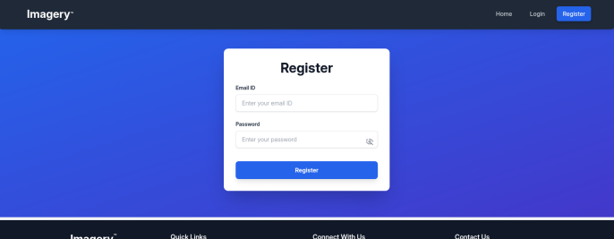

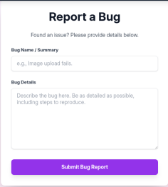

After the stored payload was reviewed by the administrative user, an administrator session value was captured and decoded:

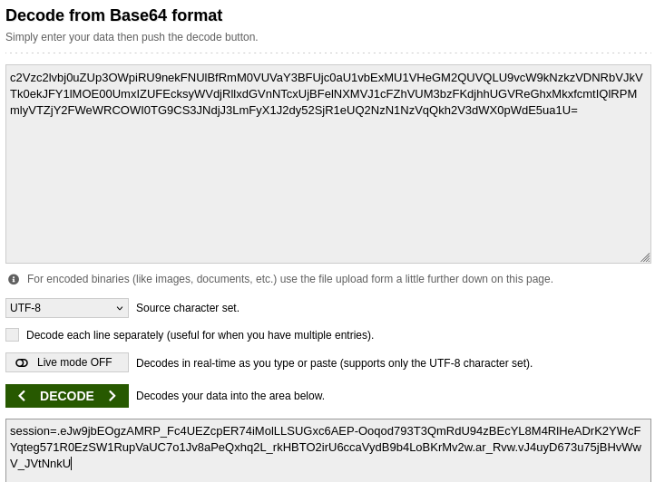

Using the captured administrator session provided access to the administrative panel:

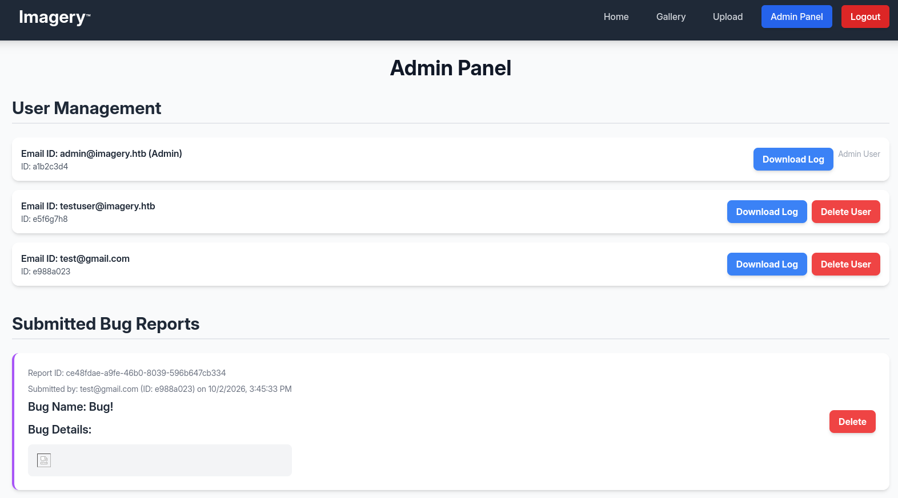

### Reproduction Summary

1. Register and authenticate as a normal application user.
2. Open the bug-report form.
3. Submit script-capable HTML/JavaScript in the **Bug Details** field.
4. Wait for the report to be reviewed by the administrative workflow.
5. Observe that the payload executes in the administrator's browser context.
6. Reuse the resulting administrator session within the authorised lab to confirm privileged access.

> **Evidence note:** The supplied screenshot set contains the captured session and resulting admin access, but does not preserve the exact XSS payload text. The payload is therefore not reconstructed in this report.

### CVSS Rationale

`AV:N/AC:L/PR:L/UI:R/S:C/C:H/I:H/A:N` — exploitation is performed remotely by an authenticated low-privilege user, requires the administrator to view the stored report, and can expose or modify high-value administrator-session data in a different security context.

### Impact

Successful exploitation allows an attacker to execute JavaScript as the reviewing administrator. In this assessment, this exposed the administrator session and provided access to privileged application functionality. Depending on the administrator's capabilities, stored XSS may allow account takeover, sensitive-data access, privileged actions and further server-side attack paths.

### Remediation

- Treat all user-controlled bug-report content as untrusted.
- Encode output according to the HTML context before rendering it.
- If rich HTML is required, apply a strict, well-tested allowlist-based sanitiser server-side.
- Set session cookies with `HttpOnly`, `Secure` and an appropriate `SameSite` policy.
- Implement a restrictive Content Security Policy (CSP) as defence in depth.
- Avoid constructing administrative HTML using raw user-controlled strings.

---

## F02 — Arbitrary File Read in Administrative Log Download Function

**Severity:** Medium  
**CVSS v3.1:** 4.9  
**Vector:** `CVSS:3.1/AV:N/AC:L/PR:H/UI:N/S:U/C:H/I:N/A:N`  
**Affected Endpoint:** `/admin/get_system_log`  
**Affected Parameter:** `log_identifier`

### Vulnerability Classification / Scope

| Field | Value |
|---|---|
| Vulnerability class | Path Traversal / Arbitrary File Read |
| CWE | CWE-22 — Improper Limitation of a Pathname to a Restricted Directory |
| OWASP mapping | A01:2021 — Broken Access Control |
| CVE | N/A — application-specific endpoint flaw |
| Affected asset | Imagery administrative log-download functionality |
| Affected parameter | `log_identifier` |
| Preconditions | Valid administrative session |
| Security boundary crossed | Intended log directory → files readable by the web-service account |

### Description

The administrator log-download endpoint trusted the `log_identifier` value as a filesystem path without adequately restricting it to the intended logging directory. With an administrative session, arbitrary local files could be requested and returned by the web application.

This was used to read operating-system files, process environment information and the Flask application's Python source code.

### Evidence / PoC

Reading `/etc/passwd`:

```http
GET /admin/get_system_log?log_identifier=/etc/passwd HTTP/1.1
```

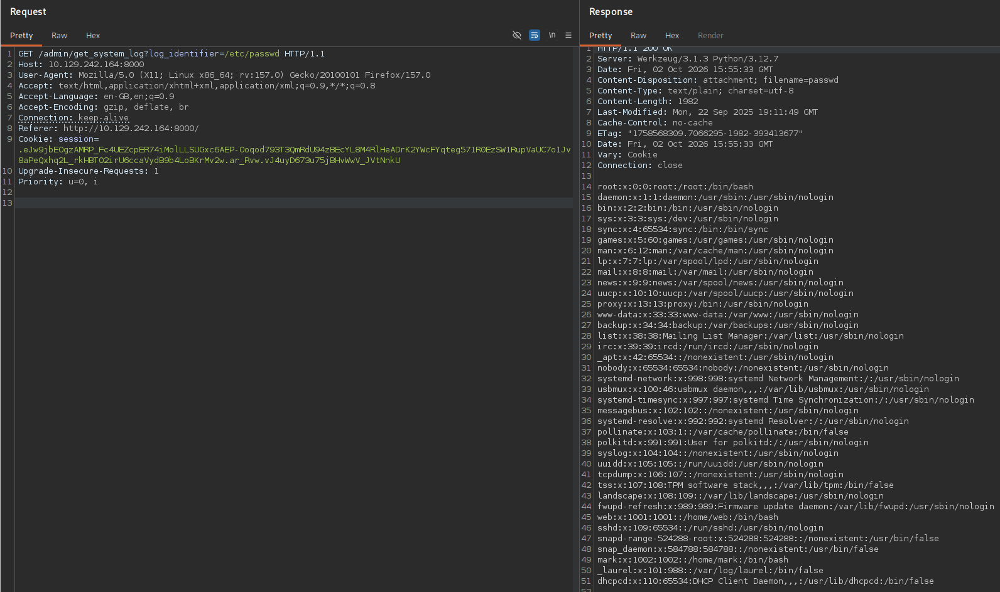

The same issue exposed `/proc/self/environ`, revealing useful runtime information for the web process:

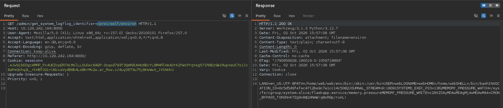

The application source was also readable directly:

```http
GET /admin/get_system_log?log_identifier=/home/web/web/app.py HTTP/1.1
```

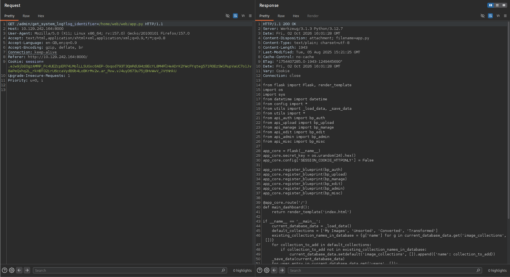

### CVSS Rationale

`AV:N/AC:L/PR:H/UI:N/S:U/C:H/I:N/A:N` — the vulnerable endpoint is remotely reachable but requires administrative privileges; exploitation is straightforward and can disclose any file readable by the service account without directly modifying data or affecting availability.

### Impact

The weakness exposes files readable by the web application's operating-system account. In this assessment it enabled source-code disclosure, environment inspection and discovery of additional attack paths. Arbitrary file read can also expose credentials, API keys, configuration files, application secrets and other host information.

### Remediation

- Never use user input directly as a filesystem path.
- Map user-selectable log identifiers to server-side filenames instead of accepting paths.
- Canonicalise the resolved path and verify it remains inside a dedicated log directory.
- Reject absolute paths, traversal sequences and unexpected filename characters.
- Run the web application with the minimum filesystem permissions required.

---

## F03 — OS Command Injection in Image Transformation Functionality

**Severity:** High  
**CVSS v3.1:** 8.8  
**Vector:** `CVSS:3.1/AV:N/AC:L/PR:L/UI:N/S:U/C:H/I:H/A:H`  
**Affected Function:** Image visual transformation / crop operation  
**Execution Context:** `web`

### Vulnerability Classification / Scope

| Field | Value |
|---|---|
| Vulnerability class | OS Command Injection |
| CWE | CWE-78 — Improper Neutralization of Special Elements used in an OS Command |
| OWASP mapping | A03:2021 — Injection |
| CVE | N/A — vulnerable command construction is in the custom Flask application |
| Affected asset | `/apply_visual_transform` image transformation workflow |
| Affected inputs | Crop / transformation parameters incorporated into a shell command |
| Preconditions | Authenticated `testuser` account and an uploaded image |
| Execution context after exploitation | Linux `web` service account |

### Description

Source-code review identified unsafe command construction within the image transformation functionality. User-controlled transformation parameters were interpolated into a command string used to invoke ImageMagick. Because the command was assembled as a string rather than safely passing each argument as a separate subprocess parameter, attacker-controlled input could influence shell execution.

The route was restricted to a designated test account. Application data disclosed through the file-read weakness contained the test-user password hash. The MD5 hash was cracked offline, permitting authenticated access to the restricted functionality.

### Evidence / PoC

The disclosed source shows the test-user gate and string-based command construction:

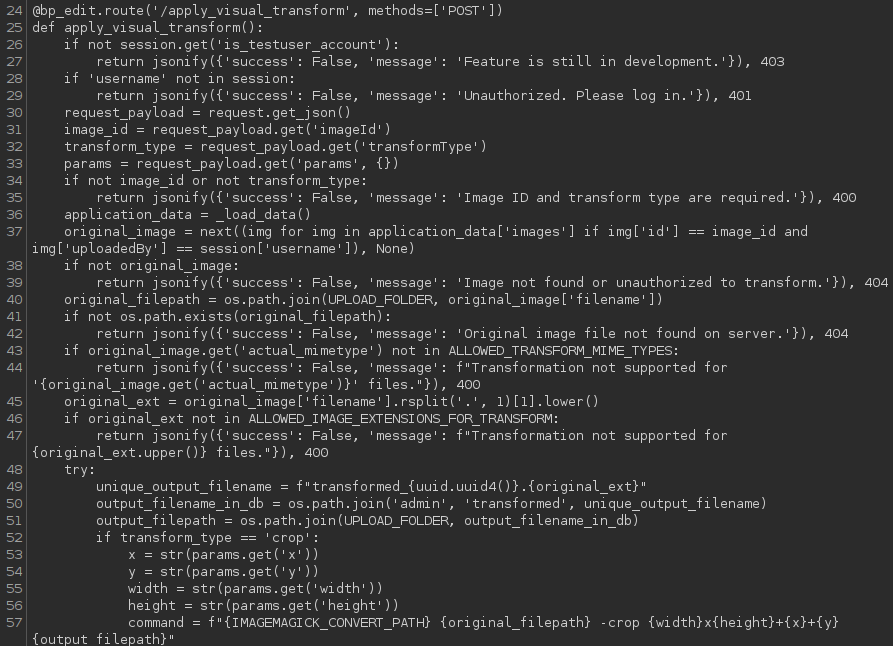

Application data exposed the test account and MD5 password hash:

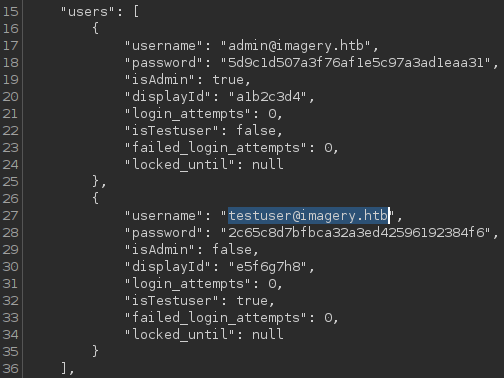

The hash was successfully recovered offline:

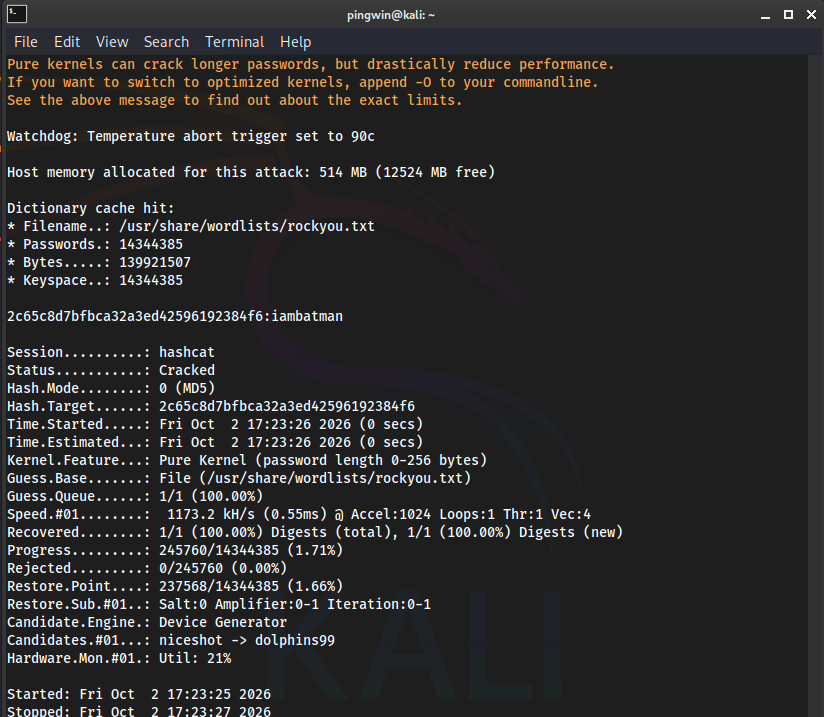

Authenticated test-user context was then available for image operations:

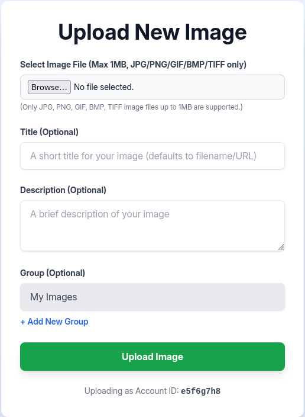

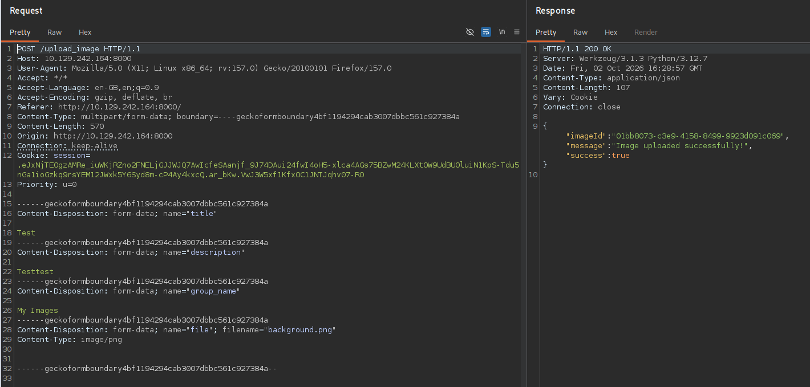

Successful exploitation of the vulnerable transformation path resulted in a reverse shell as the `web` operating-system user:

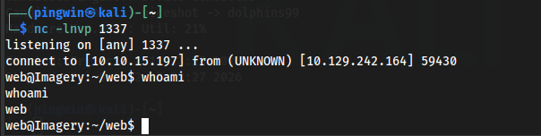

### Reproduction Summary

1. Use the arbitrary-file-read issue to inspect the application source and data store.
2. Identify the restricted image transformation function and its test-user requirement.
3. Recover the test-user credential from the weak MD5 hash.
4. Authenticate as the test user and upload an image.
5. Reach the visual-transform operation.
6. Supply shell metacharacters / command content through a vulnerable transformation parameter.
7. Confirm operating-system command execution through the authorised callback and resulting shell.

> **Evidence note:** The exact injected transform request was not preserved in the supplied screenshots. The source-code condition and resulting `web` shell are preserved, so this report documents the vulnerable code path and confirmed outcome without inventing the missing request.

### CVSS Rationale

`AV:N/AC:L/PR:L/UI:N/S:U/C:H/I:H/A:H` — the vulnerable transform endpoint is network-accessible, requires a low-privileged special account, requires no victim interaction, and successful command execution can fully compromise confidentiality, integrity and availability within the host security authority.

### Impact

A low-privileged application user with access to the restricted transformation functionality can execute arbitrary operating-system commands as the web service account. This provides direct server compromise and enables local host enumeration, credential discovery and further privilege escalation.

### Remediation

- Do not invoke a shell with attacker-controlled data.
- Use `subprocess.run()` or equivalent with a list of fixed command arguments and `shell=False`.
- Strictly validate transformation parameters as numeric values / constrained enums before use.
- Where possible, call an image-processing library directly rather than spawning command-line tools.
- Apply operating-system sandboxing and a minimally privileged service account.

---

## F04 — Weak Password Storage and Recoverable Credential Material

**Severity:** Medium  
**CVSS v3.1:** 5.5  
**Vector:** `CVSS:3.1/AV:L/AC:L/PR:L/UI:N/S:U/C:H/I:N/A:N`

### Vulnerability Classification / Scope

| Field | Value |
|---|---|
| Vulnerability class | Insecure Password Storage / Offline Credential Recovery |
| CWE | CWE-916 — Use of Password Hash With Insufficient Computational Effort |
| OWASP mapping | A02:2021 — Cryptographic Failures |
| CVE | N/A — application data-design weakness |
| Affected data | Current and historical `db.json` credential records |
| Password protection observed | Unsalted MD5 |
| Preconditions | Read access to application data or recovered backup contents |
| Security boundary crossed | Disclosed hash material → application / local account compromise where passwords are weak or reused |

> **CVSS note:** CVSS is not a perfect fit for a latent password-storage weakness. The 5.5 score assumes a low-privileged local attacker has obtained the disclosed hash material and evaluates the confidentiality impact of offline recovery.

### Description

Imagery stored application passwords as unsalted MD5 hashes. Once application data became accessible, hashes for privileged or special-purpose users could be recovered and cracked quickly using commodity password-cracking tools and standard wordlists.

Later host enumeration also exposed historical application data containing additional user hashes. The evidence set shows the older application database containing the `mark` account and the successful recovery of its plaintext password.

### Evidence / PoC

Historical application data exposed multiple user password hashes:

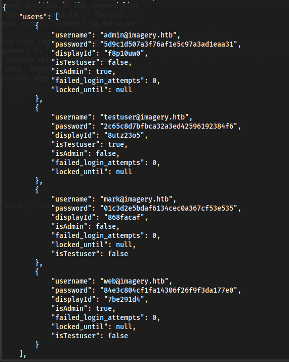

The `mark` MD5 hash was cracked offline:

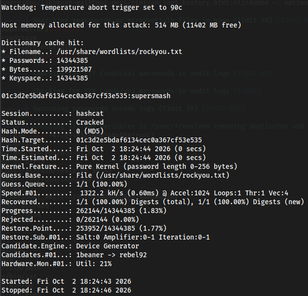

The recovered credential allowed the assessment to pivot from the web-service context to the local `mark` account. The public package intentionally omits the screenshot containing the HTB user flag.

### Evidence Gap / Supporting Context

The supplied screenshots resume after historical application data had already been recovered. They do not preserve the commands used to retrieve and decrypt the encrypted backup file. A public technical write-up for the same retired machine confirms that the intended path involves a `pyAesCrypt`-encrypted backup containing an older `db.json`, but those external commands are **not** presented here as primary assessment evidence.

### CVSS Rationale

`AV:L/AC:L/PR:L/UI:N/S:U/C:H/I:N/A:N` — this score models the observed post-compromise condition where a low-privileged local attacker can obtain hash material and recover sensitive credentials offline. It does not treat possession of an MD5 hash as equivalent to a standalone remote vulnerability.

### Impact

MD5 is unsuitable for password storage because it is fast, unsalted in this implementation and inexpensive to brute force at scale. Disclosure of the database therefore translates directly into account compromise when users choose common passwords. Credential reuse between application and operating-system contexts can turn a web compromise into lateral movement on the host.

### Remediation

- Replace MD5 password storage with a password-specific KDF such as Argon2id, bcrypt or scrypt.
- Use a unique cryptographic salt per password.
- Implement rate limits and account monitoring for online authentication attempts.
- Prevent reuse of application credentials for operating-system accounts.
- Encrypt sensitive backups with strong, unique secrets and restrict backup-file access.
- Apply retention policies so obsolete credential data is not unnecessarily preserved.

---

## F05 — Excessive Sudo Privileges Assigned to Custom Charcol Utility

**Severity:** High  
**CVSS v3.1:** 7.8  
**Vector:** `CVSS:3.1/AV:L/AC:L/PR:L/UI:N/S:U/C:H/I:H/A:H`  
**Affected Binary:** `/usr/local/bin/charcol`

### Vulnerability Classification / Scope

| Field | Value |
|---|---|
| Vulnerability class | Improper Privilege Management / Unsafe Privileged Utility |
| CWE | CWE-269 — Improper Privilege Management |
| Secondary CWE | CWE-250 — Execution with Unnecessary Privileges |
| OWASP mapping | N/A — host-level privilege-escalation finding |
| CVE | N/A — custom Charcol utility / sudo configuration |
| Affected asset | Local Linux privilege boundary on Imagery |
| Affected configuration | `(ALL) NOPASSWD: /usr/local/bin/charcol` |
| Preconditions | Local access as `mark`; access to `mark`'s system password for Charcol reset workflow |
| Security boundary crossed | Local user `mark` → effective UID 0 / root |

### Description

The local user `mark` was configured to execute the custom Charcol backup utility as any user via `sudo` without supplying a sudo password. Charcol is a privileged custom application with functionality that modifies root-owned configuration and performs file / automation operations.

Because the entire utility executed with root privileges, flaws or overly powerful legitimate functionality within Charcol crossed the intended privilege boundary. During the assessment, the Charcol password state could be reset after verifying the `mark` system password. Subsequent abuse resulted in a shell where `mark` retained its real UID but held an **effective UID of root**, confirming privilege escalation.

### Evidence / PoC

`sudo -l` confirmed passwordless execution of Charcol as any user:

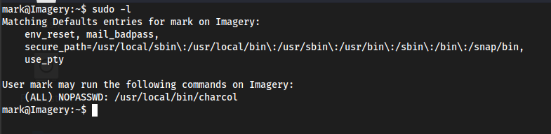

The utility permitted its root-owned configuration to be reset into no-password mode:

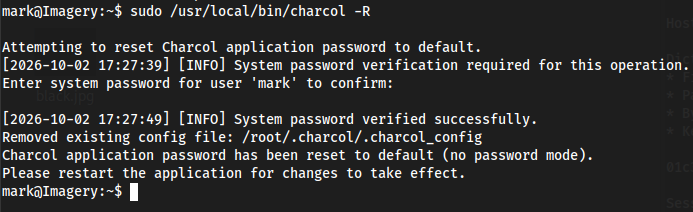

The final privilege level was validated in the original evidence with:

```text
$ bash -p
# id
uid=1002(mark) gid=1002(mark) euid=0(root) groups=1002(mark)
# whoami
root
```

The original root-validation screenshot also displayed the HTB root flag, so it has intentionally been excluded from the public evidence directory.

> **Evidence note:** The screenshot set does not preserve the precise Charcol command used between resetting the utility and the demonstrated `bash -p` root-effective shell. This report therefore records the sudo misconfiguration, privileged reset and confirmed root result, but does not reconstruct that missing exploit command.

### CVSS Rationale

`AV:L/AC:L/PR:L/UI:N/S:U/C:H/I:H/A:H` — exploitation requires local access as `mark`, no victim interaction, and misuse of the sudo-authorised utility provides root-equivalent impact across confidentiality, integrity and availability.

### Impact

A compromise of the `mark` account results in full host compromise. Root-equivalent access allows an attacker to read or modify any local data, alter system configuration, create persistence, access credentials belonging to other users and completely undermine the integrity of the machine.

### Remediation

- Remove the broad `NOPASSWD` sudo rule for the custom utility.
- Do not run feature-rich custom applications wholesale as root.
- Split privileged operations into small, narrowly scoped helper functions with strict validation.
- Prevent privileged tools from accepting arbitrary destination paths, commands, job definitions or externally fetched content.
- Require independent privileged authentication for security-sensitive configuration changes.
- Conduct a dedicated security review of custom utilities before granting sudo execution.

---

# 6. Detailed Assessment Narrative

## 6.1 Initial Application Access

A normal account was registered to understand the application workflow and identify functionality available to authenticated users. The application exposed image upload functionality and a bug-report workflow.

The bug-report functionality was prioritised because reports were expected to be reviewed by an administrator, creating a possible user-to-admin trust boundary.

## 6.2 Administrative Session Compromise

Testing of the report details field demonstrated that active content could execute when the report was rendered for an administrator. The administrator's Flask session was captured and reused to access the admin interface.

This immediately changed the attack surface: user management, bug-report review and system-log download functionality became available.

## 6.3 Arbitrary File Read and Source Review

The system-log function accepted a controllable `log_identifier`. Direct filesystem paths could be supplied, resulting in files being returned as downloadable logs. `/etc/passwd`, `/proc/self/environ` and `/home/web/web/app.py` were successfully retrieved.

The Flask source established two important facts:

- the application deliberately allowed its session cookie to be accessible to client-side script;
- the image transformation function assembled a shell command using attacker-influenced values.

Source-driven testing was then used to avoid blind payload guessing.

## 6.4 Test Account Compromise and Command Execution

Application data contained the special test account and its MD5 password hash. Offline cracking recovered the password, allowing access to development-only image transformation functionality.

An image was uploaded in the test-user context and the vulnerable transform operation was reached. Command injection through the transform parameters resulted in an outbound reverse shell as the `web` service account.

## 6.5 Local Enumeration and Pivot to Mark

After gaining the `web` shell, local enumeration identified another interactive user, `mark`, and historical application data. The older dataset contained an MD5 hash for the `mark` account. The hash was cracked successfully, allowing a user-context pivot to `mark`.

The exact encrypted-backup recovery commands are absent from the supplied evidence and are deliberately not reconstructed here.

## 6.6 Privilege Escalation

Enumeration as `mark` showed:

```text
(ALL) NOPASSWD: /usr/local/bin/charcol
```

The custom Charcol backup utility therefore ran with root privileges while remaining reachable from a compromised low-privilege account. Its application password could be reset after system-password verification, placing the tool into a no-password state.

The preserved end-state evidence demonstrates successful escalation through `bash -p`, with `euid=0(root)`. Because the intermediate Charcol abuse command was not captured, the report records the demonstrated security boundary failure rather than recreating an unobserved command sequence.

---

# 7. Remediation Priorities

## Immediate

1. Fix stored XSS in bug-report rendering and invalidate existing administrator sessions.
2. Remove arbitrary path control from `/admin/get_system_log`.
3. Remove shell-based image command construction and patch the command-injection path.
4. Remove `NOPASSWD` sudo execution of Charcol until the utility has been security reviewed.
5. Rotate credentials exposed through application databases and historical backups.

## Short Term

1. Migrate password hashes from MD5 to Argon2id/bcrypt/scrypt.
2. Review application and backup file permissions.
3. Add secure cookie attributes (`HttpOnly`, `Secure`, `SameSite`).
4. Implement automated security tests for XSS, path traversal and command injection.
5. Audit all custom root-executed tooling for arbitrary file writes, command execution and unsafe external-input handling.

## Long Term

1. Add secure-code review to development workflows.
2. Apply least privilege across application and operating-system service accounts.
3. Introduce centralised logging / monitoring for privileged actions.
4. Perform periodic authenticated web-application and local privilege reviews.
5. Separate development-only functionality from production builds.

---

# 8. Lessons Learned

Imagery was valuable because the compromise depended on **chaining several individually different weaknesses** rather than identifying one isolated exploit.

Key lessons from the assessment were:

- Administrative workflows should be tested as separate trust boundaries; stored XSS became significantly more serious because an administrator reviewed user-controlled content.
- File-download parameters deserve immediate traversal / absolute-path testing.
- Source-code access can convert an uncertain black-box assessment into a targeted code-assisted review.
- A development-only feature can still become a production attack path when account metadata or test credentials are recoverable.
- Weak password storage dramatically amplifies the impact of information disclosure.
- Local privilege escalation requires disciplined enumeration of users, backups, credentials and `sudo` permissions.
- Custom binaries allowed through `sudo` should be treated as highly sensitive attack surfaces.
- Evidence should be captured at every transition. In this report, the missing command-injection request, backup recovery commands and final Charcol abuse command made later reconstruction less precise. Future assessments should capture those steps immediately.

For CWES-style reporting practice, the most important improvement is to continue separating **discovery**, **proof of concept**, **impact**, and **remediation** rather than writing the report as a simple chronological walkthrough.

---

# 9. Evidence Integrity and Limitations

- Screenshots included in `evidence/` are copies of the supplied lab evidence and were not altered.
- Screenshots containing `user.txt` and `root.txt` values were excluded from the public evidence package.
- Password hashes and recovered lab credentials are retained only where they demonstrate the security weakness of this retired HTB environment.
- No missing command was fabricated.
---
